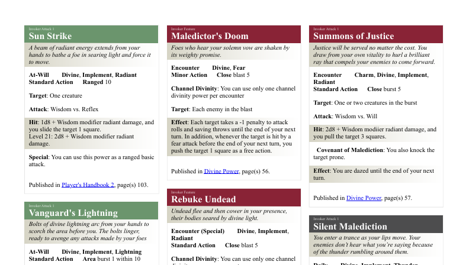

# DnD4e-Power-Printer
A tool to import .dnd4e files created from the character builder and create a pdf page containing the character powers in a manual style layout.

## Instructions
1. Download the latest release from the [releases page](https://github.com/EnricoBarbieri1997/DnD4e-Power-Printer/releases).
2. Extract the zip file to a folder of your choice.
3. Place the .dnd4e files you want to convert in the `/user/characters` folder
4. Run the `app.exe` file
5. Find the generated html files in the `/user/printables` folder
6. Use the files as is in the browser or print them to pdf or paper
